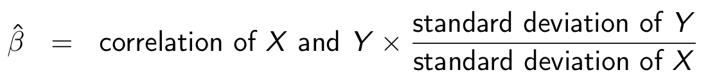

# Exam Study Guide

All questions will be based on the lecture materials. There will be around 30  multiple choice questions and simple answer questions.

---
## Recap

* In broad, a study can be either an experiment or an observational study. Randomized control trial (RCT) is a type of experiments that is in the most ideal form. You can assume that all experiments, that were covered in the class and that will be shown in the exam, are RCTs. The key attribute of RCTs is that the treatment condition was assigned at random. However in almost all of the cases we observe in the real society, such randomized treatment assignment or conducting randomized experiments is impossible. As a result, we rely on observational data sets. As an extremely rare exception, there are cases in which things happened in the real world, without the intervention of researchers at the treatment assignment stage, had randomized treatment assignment for treatment and control groups. In such case, we call the event a natural experiment.

* The following implies that the correlation coefficient between X and Y indicates how much the outcome variable Y changes as the unit of standard deviation of Y when X changes by its (X's) unit standard deviation. 
https://en.wikipedia.org/wiki/Simple_linear_regression#Fitting_the_regression_line


## Example Questions

* You are a research associate working at the National Bureau of Health Research, and you want to investigate the effect of tobacco control programs on smoking. You found two adjacent cities, city A and city B, and conducted panel surveys for 100,000 randomly selected respondents in city A and 90,000 randomly selected respondents in City B at two time points, one in May and the other in June. The program was only implemented in city A on June 1st, but never in city B. What is the average treatment effect of the program on the chance that a person smokes? Ignore the possibility of non-response bias. If necessary, calculate the result rounded to the three digit after the decimal point.


|                           | City A | City B |
|---------------------------|--------|--------|
| Number of smokers in May  | 70,000 | 60,000 |
| Number of smokers in June | 65,000 | 57,000 |

  - Estimate the sample average treatment effect using a cross-section design: 65000/100000-57000/90000=-0.017
  - Estimate the sample average treatment effect using a before-and-after design: 65000/100000-70000/100000=-0.05
  - Estimate the sample average treatment effect for the treated using the difference in differences estimator under the parallel trend assumption: (65000/100000-70000/100000)-(57000/90000}-60000/90000)=-0.017


* You saw the following regression table after running a linear regression on whether each voter chooses `LDP` candidate in a legislator election or not as a function of their `gender` (male:1; female:0) and `age`. You additionally assumed that there were heterogeneous treatment effects of gender by respondents' age. If necessary, calculate the result rounded to the three digit after the decimal point.

```
##
## Call:
## lm(formula = LDP ~ gender + age + gender:age,
##     data = election)
##
## Coefficients:
##      (Intercept)                         gender
##              0.3                            0.1
##              age                     gender:age
##            0.002                          0.001
```

- What is the sample average treatment effect of being a male compared to the case of being a female for an x years old person? 0.1 + 0.001x
- What is the sample average treatment effect of being a male compared to the case of being a female for an x+5 years old person? 0.1 + 0.001(x+5)
- What is the sample average treatment effect difference when age increases by 5 years? {0.1 + 0.001(x+5)} - (0.1 + 0.001x) = 0.005
